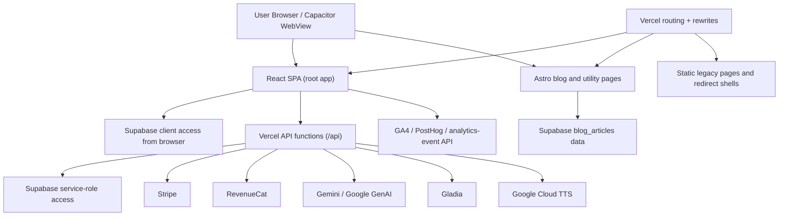

# Architecture Current State

## Scope

This document describes the current architecture that actually exists in the repo and on the deployed surface reviewed on 2026-03-07. It is not an aspirational document.

## System Map

## Major Surfaces

### 1. React SPA

Primary owner:

- `App.tsx`
- `components/*`

Responsibilities:

- authenticated learning product
- some public routes (`/pricing`, `/faq`, `/method`, `/privacy`, `/terms`, `/reset-password`)
- direct Supabase client reads and writes
- calls to `/api/*`
- offline and Capacitor behavior

Key architectural traits:

- direct client access to `profiles`, `dictionary`, `chats`, `messages`, `word_scores`, and related tables
- main tabs stay mounted through `PersistentTabs`
- public and authenticated concerns are both rooted in `App.tsx`

### 2. Astro Blog / Utility Surface

Primary owner:

- `blog/src/pages/*`
- `blog/src/layouts/*`

Responsibilities:

- `/learn/*`
- `/compare/*`
- `/tools/*`
- `/dictionary/*`
- intended `/support/`
- sitemap endpoints

Key architectural traits:

- public SEO surface
- article data comes from Supabase, not MDX content collections
- styling and typography are materially different from the app

### 3. Vercel Routing Layer

Primary owner:

- `vercel.json`

Responsibilities:

- redirects for legacy content
- ownership between SPA, static pages, and Astro output
- top-level route rewrites

Key architectural traits:

- catch-all rewrite controls whether many top-level routes reach Astro at all
- route ownership is not generated from shared code
- this layer can silently override app/blog intent

### 4. API Layer

Primary owner:

- `api/*.ts`
- `utils/api-middleware.ts`

Responsibilities:

- authenticated business logic
- service-role database operations
- payment flows and webhooks
- AI integrations
- analytics ingestion

Key architectural traits:

- mostly consistent auth middleware pattern
- several direct service-role queries against `profiles`
- one auth-optional edge endpoint for analytics

### 5. Mobile Wrapper

Primary owner:

- `capacitor.config.ts`
- `services/api-config.ts`

Responsibilities:

- bundle the SPA into a native shell
- force API calls to production host from native

Current limitation:

- `ios/` and `android/` projects are not present in this repo, so native entitlement and plist verification are blocked from code audit alone

### 6. Auxiliary Package: promo-video

Primary owner:

- `promo-video/*`

Responsibilities:

- promotional video generation via Remotion

Current limitation:

- it is a separate package with its own dependencies, but root verification still trips over its files

## Route Ownership Matrix

| Route family | Intended owner in source | Actual deploy owner now | Notes |
| --- | --- | --- | --- |
| `/` and authenticated app tabs | React SPA | React SPA | Works as expected |
| `/pricing`, `/faq`, `/method`, `/privacy`, `/terms` | React SPA and static/dist output | Mixed, but currently reachable | Public routes live inside SPA code |
| `/learn/*` | Astro | Astro | Healthy after remediation work |
| `/compare/*` | Astro/static compare pages | Astro/static compare pages | Has special rewrite rules |
| `/tools/*` | Astro | Astro | Healthy in current SEO work |
| `/dictionary/*` | Astro | Astro | Healthy in current SEO work |
| `/support/` | Astro page exists | SPA homepage shell in prod | Confirmed live conflict |
| locale stubs like `/pl/` | static legacy redirect shells | static redirect shells | intentionally non-indexable |
| `story.lovelanguages.io` | isolated static story surface | isolated by host redirect | preserved |

## Data Access Model

| Data path | Current pattern | Risk |
| --- | --- | --- |
| user profile and partner data | direct client Supabase reads from `profiles` | secret exposure and schema coupling |
| learning data (`dictionary`, `word_scores`, `messages`, `chats`) | direct client reads plus some API writes | query budgets and performance drift |
| payments | mixed Stripe portal/session endpoints + RevenueCat reconciliation | source divergence |
| blog articles | Supabase reads in blog runtime/scripts | env/config coupling |
| analytics | browser -> GA4/PostHog + browser -> `analytics-event` | forged per-user events |

## Boundary Violations

### Profiles boundary violation

`profiles` is acting as:

- user display data
- partner relationship data
- entitlement state
- device/onboarding settings
- payment-provider identifiers
- Apple refresh-token storage

This is the single most important architectural problem in the repo.

### Route boundary violation

The route owner for a page can only be determined by consulting:

- `App.tsx`
- `vercel.json`
- `vite.config.ts`
- Astro page tree
- SEO inventory exceptions

That is too many places for one core contract.

### Tooling boundary violation

The repo contains multiple logical projects, but root verification treats them as one:

- app
- blog
- promo-video
- e2e

That is why `tsc`, Vitest, and CI are noisy and misleading.

## Current Hotspots by Architecture Risk

### `App.tsx`

- owns auth, routing, analytics setup, offline bootstrap, revenue reconciliation, and public-route fallback decisions

### `utils/api-middleware.ts`

- centralizes auth, rate limits, subscription logic, and security headers
- small changes here alter behavior across dozens of endpoints

### `vercel.json`

- effectively part of the application runtime
- can override source-level route intent

### `blog/src/lib/blog-api.ts`

- critical for route generation, sitemap completeness, and content coverage

## Architecture Assessment

What is good:

- clear separation between public content and authenticated product intent exists at a high level
- API layer mostly uses shared auth/security middleware
- new SEO tooling provides a stronger operational lens than before

What is weak:

- secret boundaries are not enforced structurally
- route ownership is not centralized
- workspace tooling is not aligned with repo topology
- app/blog design and docs are not converged

The target architecture should reduce the number of "shared truth by convention" surfaces and replace them with explicit contracts.
