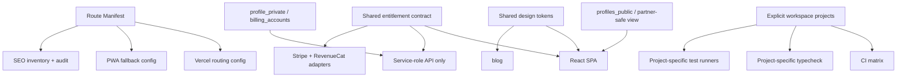

# Architecture Target State

## Goals

The target architecture should do five things:

1. make secret boundaries structural, not conventional
2. make route ownership explicit and machine-readable
3. make payment-provider choice a first-class contract
4. make repo tooling match repo topology
5. make public design and documentation systems converge

## Target Principles

### 1. Secret-bearing data never lives in partner-readable rows

Target rule:

- `profiles` contains only fields safe for the owner and partner-safe views
- secret-bearing or provider-operational fields move to a private table such as `profile_private` or `billing_accounts`

Minimum acceptable boundary:

- no refresh tokens in `profiles`
- no provider customer IDs readable via partner-facing client queries
- no client-side `select('*')` on `profiles`

### 2. Route ownership comes from one manifest

Introduce one route manifest with entries like:

- path pattern
- owner: `spa`, `astro`, `static`, `redirect`
- indexability intent
- offline-fallback behavior

That manifest should drive:

- `vercel.json` generation or validation
- PWA navigateFallback denylist generation
- SEO inventory classification
- route ownership tests

### 3. Subscription source is first-class everywhere

Define one shared subscription contract:

- effective plan
- status
- source: `stripe`, `app_store`, `gift`, `promo`, `trial`, `inherited`
- management action type

Use it in:

- `types.ts`
- `/api/subscription-status`
- account UI
- entitlement middleware

### 4. Workspace boundaries are explicit

Convert the repo from implicit multi-project to explicit multi-project.

Recommended structure:

- root app project
- `blog/` project
- `promo-video/` project
- `e2e/` test project

Each gets:

- its own `tsconfig`
- its own test entrypoint
- its own dependency lifecycle

Root CI should orchestrate them rather than pretending they are one project.

### 5. Shared tokens span app and blog

Publish one shared design token source for:

- typography
- colors
- spacing
- radius
- shadows
- motion durations

The blog can keep an editorial flavor, but not a completely different font and token system.

## Recommended Target Topology

## Proposed Structural Changes

### A. Data Model

Create or move to:

- `profiles`
  - relationship-safe identity and UX settings only
- `profile_private`
  - Apple token, provider customer IDs, operational flags
- `billing_accounts`
  - provider-specific subscription identifiers and source state

RLS shape:

- client can read own `profiles`
- partner can read only `profiles_public` or a limited partner view
- only service role reads `profile_private` and `billing_accounts`

### B. Service Boundaries

Split business logic into explicit services:

- `services/route-ownership`
- `services/subscription-contract`
- `services/profile-access`
- `services/seo-contract`

Do not keep these as informal conventions spread through `App.tsx`, `vercel.json`, and scripts.

### C. Query Budgets

Adopt fetch-budget rules:

- initial screen load never fetches unbounded history
- any full-history sync must be explicit and instrumented
- offline cache is capped or incrementally hydrated

Make these visible in code review.

### D. Verification

Target CI matrix:

1. `typecheck:app`
2. `typecheck:blog`
3. `typecheck:promo-video`
4. `test:unit`
5. `test:e2e:discovery`
6. `build:app`
7. `build:blog`
8. `seo:inventory`
9. `seo:audit` against preview

## Migration Order

Order matters:

1. lock down secret exposure first
2. make CI honest second
3. normalize subscription-source contract third
4. centralize route ownership fourth
5. then do design/doc convergence

Why:

- secret exposure is the only P0
- honest verification is prerequisite for safe refactors
- route and payment fixes span many surfaces and need working tests

## Non-Negotiable Rules for the Target State

- no secret-bearing fields in partner-readable client rows
- no wildcard client profile selects
- no public route without a declared owner
- no root CI job that cannot run from a clean clone
- no doc that claims a sweep is complete without a matching verification artifact

## Exit Criteria

The target architecture can be considered established when:

- `AUD-001` through `AUD-006` are closed
- preview and production SEO audits agree on the intended public surface
- app/blog typography and token systems are sourced from the same contract
- root verification is split into truthful project-level gates
